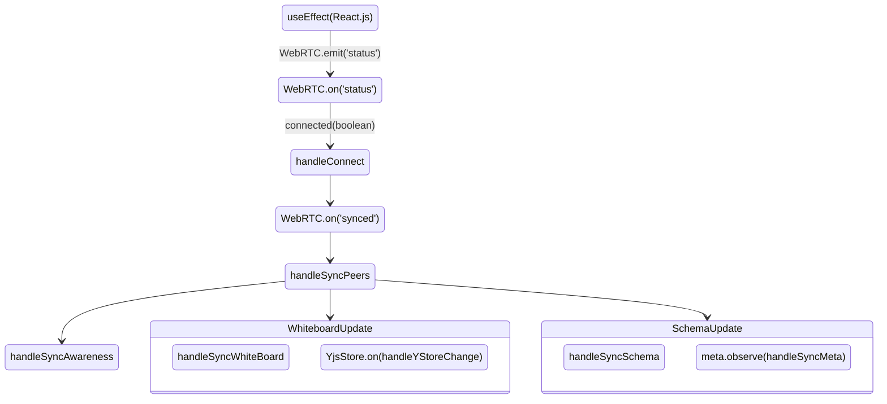
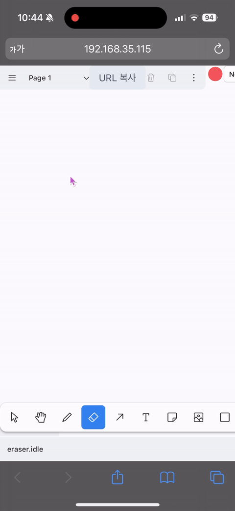
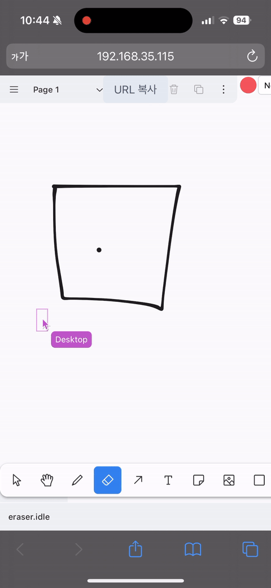
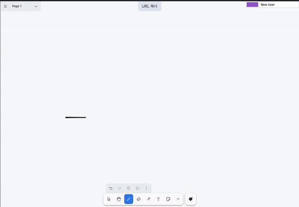

# tldraw-webrtc-example

## 애플리케이션 설정 및 실행방법

패키지 설치

```
pnpm install
```

개발환경 실행 (시그널링 서버 실행 포함)

```
pnpm dev
```

빌드 및 빌드 된 코드 실행 (시그널링 서버 실행 포함)

```
pnpm build
pnpm serve
```

시그널링 서버만 별도로 실행

```
pnpm signaling:start
```

---

## 사용된 아키텍처 및 기술

- TypeScript
  - 자바스크립트의 정적 타입을 명시하여 타입 기반으로 코드를 작성할 수 있게 함
- React.js
  - 화면을 그리기 위한 라이브러리
- **tldraw**
  - 화이트 보드 인터페이스 구현
- **yjs**
  - 실시간 공동 작업 구현을 위해 사용
  - 내부 데이터 구조를 공유하여 CRDT(동시에 데이터를 수정할 때 발생되는 충돌 문제를 해결) 구현이 구현된 객체
  - Y.Doc 를 통해 document 개념을 만들어 연결된 클라이언트들에게 sync 할 수 있게 처리
  - 다양한 네트워크 프로바이더를 제공하며 (y-websocket, y-webrtc 등) 별도의 추가기능 없이 적용만 하면 연결된 클라이언트 간 동일한 상태관리를 위해 데이터를 유지
- **y-utility (YKeyValue)**
  - key-value pair 데이터를 저장하고 관리할 수 있게 해주는 역할
  - 단순하고 직관적인 key-value pair 데이터를 관리할 때 유용함
  - 데이터를 번갈아 반복작성 해야 하는 경우에 적합하여 사용
    - Y.Map 은 잠재적인 충돌 요소를 방어하기 위해 기록된 모든 키를 유지 해야함
    - 그리고 특정 키를 삭제 하더라도 데이터 용량에 변화가 없음
- **y-webrtc**
  - Yjs 라이브러리를 위한 WebRTC 프로바이더
  - 문제 요구사항이 중앙서버를 기준으로 데이터를 전송하지 않고 피어간의 통신으로 진행해야 함으로 활용
  - 중앙서버는 아니지만, WebRTC 통신을 위한 Signaling 서버도 내장되어있어서 구현 시 함께 사용
- Tailwind
  - Utility Classname 기반의 스타일 라이브러리로 별도의 CSS Style 를 작성하지 않고 클래스 기반으로 간단한 UI 를 그리기 위해 사용
- uuid
  - 피어가 방을 생성할 때 URL Path로 사용하기 위하여 사용

### useYjs Hook

**1. 상태**

- storeWithStatus: `<TldrawEditor/>` 컴포넌트의 store prop 에 들어갈 상태 조합
- store
  - yDoc 와의 실시간 데이터 동기화를 위한 처리
  - 화이트 보드 내 record 정보 컬랙션
  - 원격으로 받아온 데이터를 화이트보드에 병합
  - 스키마 정보 관리
- yDoc
  - 피어들간 상태 관리를 위한 Yjs 객체
- yStore
  - key-value pair 의 데이터 관리를 위한 yjs store
- provider
  - websocket provider
  - 이벤트 관리
- meta
  - yjs의 데이터 스키마를 가져오고, 메타 데이터를 관찰하기 위함
  - 스키마 변경시 데이터를 일관성있게 유지하고, 맞지 않다면 페이지 새로고침을 통해 최신 스키마가 로딩될 수 있도록 관리 필요

**2. 이벤트 처리 순서도**



## 운영 환경에 대한 필요한 배경 정보 또는 가정

- 빌드 및 빌드 된 코드를 실행하게 되면 동일한 네트워크에서는 `http://실행한 컴퓨터의 IP주소:3000` 통해 접근 가능
  - VPN 과 같은 일부 네트워크의 개별설정으로 인해 WebRTC가 접근은 가능하지만 동작이 가능하지 않을 수 있으므로 확인 필요

### iPhone 시연 (운영 환경과 동일한 네트워크에 있는 경우)

데스크탑 클라이언트에서 화이트 보드 변경 사항을 실시간으로 모바일 클라이언트에서 확인(1)


데스크탑 클라이언트에서 화이트 보드 변경 사항을 실시간으로 모바일 클라이언트에서 확인(2)


### Desktop 시연

모바일 클라이언트에서 화이트 보드 변경 사항을 실시간으로 데스크탑 클라이언트에서 확인

